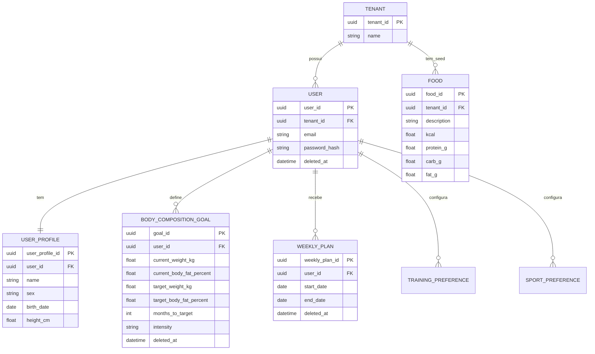
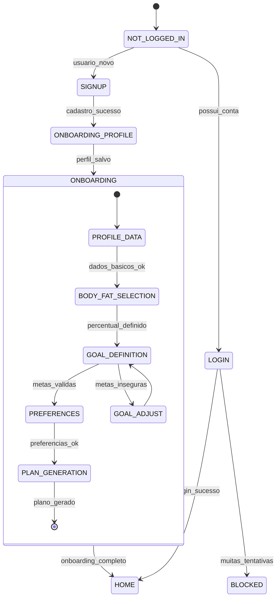
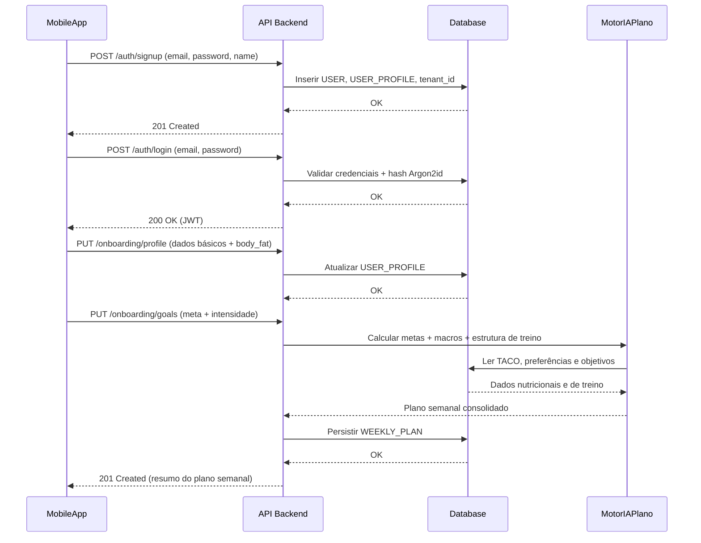

# PRD Técnico – Épico 1: Autenticação, Onboarding Inteligente e Motor de Metas

## 0. Contexto e Objetivo

O produto é um app mobile Android que ajuda o usuário a definir e acompanhar semanalmente sua dieta e seus treinos, com base em objetivos de composição corporal (perder gordura, ganhar massa, manutenção) e preferências de alimentação e esportes.  
Este épico estabelece a fundação técnica: autenticação segura multi-tenant (whitelabel), onboarding de perfil corporal e metas, e o primeiro motor de cálculo de metas e planos semanais, servindo como base para os próximos épicos de detalhamento de treino e alimentação.

## 0.1 Critérios de Sucesso

- **UX/Retenção:** tempo médio de conclusão do onboarding \< 3 minutos; taxa de conversão (Signup → Fim do Onboarding) ≥ 80%.
- **Engenharia de Dados:** carga inicial (*seed*) da tabela nutricional (TACO) com 100% de sucesso, sem chamadas a APIs externas de nutrição em produção.
- **Segurança e Escalabilidade:** zero tráfego de senha em *plain text*; 100% das tabelas de domínio com `tenant_id`; autenticação 100% baseada em JWT.

---

## 1. Dicionário de Dados (com IDs)

> Formato: ID, Descrição, Fonte de Negócio, Impacto, Relacionamentos principais.

### 1.1 Entidades Principais

| ID              | Descrição                                                                                     | Fonte de Negócio                                             | Impacto                                                                                              | Relacionamentos principais                                                                                                                                      |
|-----------------|-----------------------------------------------------------------------------------------------|--------------------------------------------------------------|-----------------------------------------------------------------------------------------------------|-----------------------------------------------------------------------------------------------------------------------------------------------------------------|
| DD-ENT-TENANT   | Locatário lógico do app (marca/produto whitelabel).                                          | Estratégia whitelabel e reaproveitamento de API.            | Isolamento de dados entre marcas e clientes corporativos.                                           | `Tenant` 1:N `User`, 1:N `WeeklyPlan`, 1:N `Food`.                                                                                                              |
| DD-ENT-USER     | Usuário final autenticado do app.                                                             | Objetivo do produto (uso individual).                        | Base de todas as jornadas de login, onboarding e planos.                                            | `User` N:1 `Tenant`, 1:1 `UserProfile`, 1:N `BodyCompositionGoal`, 1:N `WeeklyPlan`.                                                                            |
| DD-ENT-USERPROFILE | Perfil estático e semiestático do usuário (nome, sexo, data de nascimento, altura, etc.). | Onboarding inicial.                                          | Necessário para cálculos de gasto calórico e avaliação de metas.                                   | 1:1 com `User`.                                                                                                                                                 |
| DD-ENT-BODYCOMPOSITIONGOAL | Meta de composição corporal (peso alvo, % de gordura alvo, horizonte de tempo, intensidade). | Onboarding de metas.                                         | Dirige o motor de metas e o planejamento de dieta/treino.                                           | N:1 `User`, N:1 `Tenant`.                                                                                                                                       |
| DD-ENT-TRAININGPREFERENCE  | Preferências de treino (foco estético, grupos musculares, tipo de equipamento).    | Preferências de esporte e treino.                            | Constrói a lógica de geração das fichas de treino e distribuição semanal.                           | N:1 `User`, N:1 `Tenant`.                                                                                                                                       |
| DD-ENT-SPORTPREFERENCE     | Preferências de esportes (natação, corrida, musculação, tênis, futebol, etc.).     | Premissa funcional de esportes preferidos.                   | Permite que o motor de treino proponha atividades alinhadas com aderência real do usuário.         | N:1 `User`, N:1 `Tenant`.                                                                                                                                       |
| DD-ENT-FOOD (TACO)         | Alimentos e composição nutricional conforme TACO.                                  | Banco TACO (tabela oficial brasileira).                      | Base para cálculo de calorias e macros semanais.                                                    | N:1 `Tenant` (seed padrão), relacionamentos lógicos com `Meal`/`DailyMealPlan` em épicos futuros.                                                              |
| DD-ENT-WEEKLYPLAN          | Plano semanal consolidado que agrupa treino e alimentação.                         | Objetivo do app: dieta e treino semanais.                    | Unidade de planejamento consumida pelas telas de “Treino” e “Alimentação”.                         | N:1 `User`, N:1 `Tenant`, 1:N `WorkoutSession`, 1:N `DailyMealPlan` (detalhe em épicos futuros).                                                               |
| DD-ENT-AUTHSESSION         | Sessão lógica de autenticação baseada em JWT.                                     | Segurança e experiência de login sem fricção.               | Controle de acesso, expiração e revogação de sessões.                                               | N:1 `User`, N:1 `Tenant`.                                                                                                                                       |

### 1.2 Tabelas de Requisitos e Entidades para Rastreabilidade

Todas as tabelas lógicas que documentam requisitos e entidades devem seguir o padrão:

- Colunas obrigatórias: `ID`, `Descrição`, `FonteDeNegócio`, `Impacto`, `Relacionamentos`, `TestesAssociados` (referências a cenários `SCN-*` e testes automatizados).

---

## 2. Requisitos Funcionais (cada um com REQ-*)

> Cada requisito possui ID único, descrição e relação com cenários BDD (`SCN-*`).

### 2.1 Autenticação e Recuperação de Acesso

- **REQ-AUTH-001 – Login com JWT:**  
  O sistema deve permitir login por e-mail e senha, emitindo um JWT contendo `tenant_id`, `sub` (user_id), `roles` e `exp` após autenticação bem-sucedida.  
  - **Cobertura BDD:** `SCN-AUTH-LOGIN-SUCESSO` (a ser detalhado posteriormente).

- **REQ-AUTH-002 – Prevenção de Força Bruta no Login:**  
  Após 5 tentativas consecutivas de login com credenciais inválidas para o mesmo par (IP, e-mail), a 6ª tentativa deve retornar HTTP 429 e bloquear novas tentativas por 15 minutos.  
  - **Cobertura BDD:** `SCN-AUTH-BLOQUEIO-FALHAS` (ver seção 5.1).

- **REQ-AUTH-003 – Recuperação de Senha:**  
  O sistema deve oferecer fluxo de “Esqueci minha senha” com envio de e-mail contendo token temporário e endpoint de redefinição de senha.  
  - **Cobertura BDD:** `SCN-AUTH-RECUPERACAO` (a ser detalhado posteriormente).

### 2.2 Onboarding – Dados Biométricos e Metas

- **REQ-ONB-001 – Coleta de Dados Básicos:**  
  Durante o onboarding, o sistema deve coletar nome, sexo, data de nascimento, peso atual, altura, percentual de gordura atual (informado ou estimado) e meta de peso, meta de % de gordura e tempo até a meta.  
  - **Cobertura BDD:** `SCN-ONB-DADOS-BASICOS`.

- **REQ-ONB-002 – Estimativa Visual de % de Gordura:**  
  Se o usuário indicar que não sabe seu percentual de gordura, o app deve exibir imagens padronizadas de biotipo; a seleção de uma imagem envia um identificador para a API, que grava o valor correspondente em `body_fat_percentage`.  
  - **Cobertura BDD:** `SCN-ONB-BIOTIPO-VISUAL` (ver seção 5.2).

- **REQ-ONB-003 – Seleção de Objetivo e Intensidade:**  
  O onboarding deve permitir selecionar objetivo (perder gordura, ganhar massa, manutenção) e intensidade (Leve, Medium, High), que serão usados pelo motor de metas.  
  - **Cobertura BDD:** `SCN-GOAL-METAS-MEDIUM` (ver seção 5.3).

### 2.3 Motor de Metas e Plano Semanal Inicial

- **REQ-GOAL-001 – Validação de Taxa de Perda de Peso:**  
  Para objetivos de emagrecimento, o motor de metas deve rejeitar ou ajustar metas cuja taxa de perda exceda 1,5% do peso corporal por semana.  
  - **Cobertura BDD:** `SCN-GOAL-METAS-MEDIUM`.

- **REQ-GOAL-002 – Cálculo de Déficit Calórico:**  
  Para intensidade “Medium”, o motor de metas deve aplicar déficit calórico base de 20% sobre o Gasto Calórico Total (GCT) calculado por fórmula validada (assumido Mifflin-St Jeor, ver seção 7).  
  - **Cobertura BDD:** `SCN-GOAL-METAS-MEDIUM`.

- **REQ-GOAL-003 – Uso de Tabela TACO:**  
  O motor deve consultar a tabela TACO local para compor as refeições diárias com foco em suprimento proteico suficiente para preservar massa magra, respeitando macros derivadas da meta.  
  - **Cobertura BDD:** `SCN-GOAL-METAS-MEDIUM`.

- **REQ-PLAN-001 – Geração de Rotina Semanal com Preferências de Treino:**  
  O sistema deve gerar uma estrutura semanal de treino respeitando preferências como foco em membros superiores, restrição a exercícios em máquinas e distribuição de dias de treino/descanso.  
  - **Cobertura BDD:** `SCN-TRAIN-ROTINA-MAQUINAS` (ver seção 5.4).

- **REQ-PLAN-002 – Disponibilização em Abas:**  
  Após a primeira geração bem-sucedida do plano, o app deve apresentar o conteúdo organizado em três abas: `Perfil`, `Treino` e `Alimentação`, permitindo revisão e edição posterior.  
  - **Cobertura BDD:** `SCN-UI-ABAS-SEMANAIS` (escopo de frontend para épico futuro; aqui serve como contrato funcional).

---

## 3. Requisitos Não-Funcionais (cada um com NFR-*)

- **NFR-ARCH-001 – Multi-Tenancy por `tenant_id`:**  
  Toda tabela de domínio deve conter a coluna `tenant_id` (UUIDv4). Políticas de Row-Level Security (RLS) devem ser configuradas no banco de dados (PostgreSQL) para filtrar registros por `tenant_id` extraído do JWT.

- **NFR-ARCH-002 – Soft Delete:**  
  Para `User`, `UserProfile`, `BodyCompositionGoal` e `WeeklyPlan`, o sistema deve adotar *Soft Delete* com coluna `deleted_at` (timestamp). Consultas padrão devem ignorar registros onde `deleted_at` não seja nulo.

- **NFR-SEC-001 – Hash de Senhas com Argon2id:**  
  Senhas devem ser armazenadas usando Argon2id com parâmetros memoryCost, timeCost e parallelism configurados para que o tempo de geração do hash fique entre 200–500ms em hardware de referência.

- **NFR-SEC-002 – Sessão Stateless via JWT:**  
  Todos os endpoints autenticados devem validar JWT contendo, no mínimo, `tenant_id`, `sub`, `roles`, `exp`. Nenhum dado sensível de PII adicional deve ser inserido no payload.

- **NFR-SEC-003 – Rate Limiting em Autenticação:**  
  Endpoints de login e recuperação de senha devem estar protegidos por algoritmo de rate limiting tipo Token Bucket, com capacidade e taxa de reabastecimento a serem definidas pela equipe de infraestrutura, garantindo retorno HTTP 429 em sobrecarga.

- **NFR-PERF-001 – Desempenho do Onboarding:**  
  P95 de tempo de resposta da API para etapas de onboarding deve ser \< 300ms sob carga de referência de 100 requisições por segundo por tenant.

- **NFR-UX-001 – Fluidez de Navegação:**  
  Transições de telas no app Flutter durante o onboarding devem ocorrer com P95 \< 200ms em dispositivos Android de referência.

---

## 4. Contratos OpenAPI (YAML/JSON resumido)

> Os exemplos abaixo são contratuais; detalhes adicionais podem ser refinados pelo Arquiteto e pelos agentes de backend.

```yaml
openapi: 3.1.0
info:
  title: Fitness Coach API
  version: 1.0.0

paths:
  /api/v1/auth/signup:
    post:
      operationId: signupUser
      summary: Cria usuário e associa a um tenant.
      requestBody:
        required: true
        content:
          application/json:
            schema:
              type: object
              required: [email, password, name]
              properties:
                email: { type: string, format: email }
                password: { type: string, minLength: 8 }
                name: { type: string }
      responses:
        '201':
          description: Usuário criado com sucesso.
        '409':
          description: Email já utilizado.

  /api/v1/auth/login:
    post:
      operationId: loginUser
      summary: Autentica usuário e retorna JWT.
      requestBody:
        required: true
        content:
          application/json:
            schema:
              type: object
              required: [email, password]
              properties:
                email: { type: string, format: email }
                password: { type: string }
      responses:
        '200':
          description: Login bem-sucedido.
          content:
            application/json:
              schema:
                type: object
                properties:
                  access_token: { type: string }
        '401':
          description: Credenciais inválidas.
        '429':
          description: Muitas tentativas (rate limit / força bruta).

  /api/v1/onboarding/profile:
    put:
      operationId: completeOnboardingProfile
      summary: Persiste dados básicos e biométricos do usuário.
      security:
        - bearerAuth: []
      requestBody:
        required: true
        content:
          application/json:
            schema:
              type: object
              required: [name, sex, birth_date, weight_kg, height_cm]
              properties:
                name: { type: string }
                sex: { type: string, enum: [male, female, other] }
                birth_date: { type: string, format: date }
                weight_kg: { type: number }
                height_cm: { type: number }
                body_fat_percentage: { type: number, nullable: true }
                body_fat_visual_id: { type: string, nullable: true }
      responses:
        '200':
          description: Perfil atualizado.
        '400':
          description: Payload inválido.

  /api/v1/onboarding/goals:
    put:
      operationId: defineBodyCompositionGoal
      summary: Define metas de composição corporal e intensidade.
      security:
        - bearerAuth: []
      requestBody:
        required: true
        content:
          application/json:
            schema:
              type: object
              required: [current_weight_kg, current_body_fat_percent, target_weight_kg, target_body_fat_percent, months_to_target, intensity]
              properties:
                current_weight_kg: { type: number }
                current_body_fat_percent: { type: number }
                target_weight_kg: { type: number }
                target_body_fat_percent: { type: number }
                months_to_target: { type: integer, minimum: 1 }
                intensity: { type: string, enum: [light, medium, high] }
      responses:
        '200':
          description: Meta aceita e armazenada.
        '422':
          description: Meta fisiologicamente insegura.

  /api/v1/plans/weekly:
    post:
      operationId: generateWeeklyPlan
      summary: Gera plano semanal de treino e alimentação.
      security:
        - bearerAuth: []
      responses:
        '201':
          description: Plano semanal gerado.
        '422':
          description: Dados de onboarding incompletos.
```

---

## 5. Cenários BDD (cada um com SCN-*)

> Sintaxe Gherkin estrita, 1 comportamento por cenário.

### 5.1 Autenticação Segura

**Feature: Autenticação e proteção contra força bruta**

**SCN-AUTH-BLOQUEIO-FALHAS – Bloqueio temporário após múltiplas tentativas falhas**

```gherkin
Scenario: Bloqueio temporário após múltiplas tentativas falhas
  Given um usuário não autenticado está na tela de login
  And insere credenciais inválidas 5 vezes consecutivas
  When a sexta tentativa de login é enviada para o backend
  Then a API deve retornar o status HTTP 429 (Too Many Requests)
  And o sistema deve bloquear novas tentativas para aquele par IP/e-mail por 15 minutos
```

### 5.2 Onboarding – Perfilamento Biométrico

**Feature: Estimativa de percentual de gordura por biotipo visual**

**SCN-ONB-BIOTIPO-VISUAL – Atribuição de % de gordura via seleção de biotipo**

```gherkin
Scenario: Atribuição de percentual de gordura via seleção de biotipo
  Given o usuário está no passo de biometria do onboarding
  And seleciona a opção de que não sabe seu percentual atual
  When o usuário escolhe a imagem padronizada correspondente a um perfil de 25% de gordura corporal
  Then o frontend deve enviar o identificador da imagem para a API
  And o backend deve salvar o valor 25 na coluna body_fat_percentage, associado ao tenant_id e user_id corretos
```

### 5.3 Motor de Metas

**Feature: Validação de trajetória sustentável de emagrecimento**

**SCN-GOAL-METAS-MEDIUM – Parametrização de emagrecimento a longo prazo (intensidade Medium)**

```gherkin
Scenario: Parametrização de emagrecimento a longo prazo com segurança fisiológica
  Given o usuário informa peso atual de 99 kg e percentual de gordura de 25%
  And define meta alvo de 88 kg com 14% de gordura em um prazo de 7 meses
  And seleciona a intensidade Medium
  When o motor de cálculo processa esses dados
  Then o sistema deve validar que a taxa de perda é inferior ao teto de 1.5% do peso corporal por semana
  And deve aplicar um déficit calórico de 20% sobre o Gasto Calórico Total calculado
  And deve buscar na tabela TACO alimentos que garantam o suprimento proteico necessário para preservação de massa magra
```

### 5.4 Flexibilidade de Rotinas de Treino

**Feature: Geração de ficha personalizada com foco estético em máquinas**

**SCN-TRAIN-ROTINA-MAQUINAS – Rotina avançada com foco em membros superiores em máquinas**

```gherkin
Scenario: Rotina avançada com foco em membros superiores usando apenas máquinas
  Given o usuário indica prioridade no fortalecimento de membros superiores (bíceps e tríceps)
  And marca preferência restrita por exercícios em máquinas
  When o algoritmo gerador de rotinas monta a estrutura semanal
  Then o sistema deve incluir um "Upper Day Estético" alocado aos sábados
  And deve alocar treinos de pernas (quadríceps e posterior) para quinta-feira e domingo
  And deve definir segunda-feira como dia de descanso
  And deve definir sexta-feira como descanso ativo
  And deve excluir exercícios de peso livre (ex.: barra livre) das sugestões primárias
```

---

## 6. Diagramas Mermaid (ERD, stateDiagram, sequenceDiagram)

### 6.1 ERD – Domínio de Autenticação, Onboarding e Metas



### 6.2 stateDiagram – Fluxo de Onboarding



### 6.3 sequenceDiagram – Geração do Primeiro Plano Semanal



---

## 7. Perguntas em Aberto e Suposições

- **Suposição 1 – Fórmula de Gasto Calórico:**  
  Supomos o uso da fórmula de Mifflin-St Jeor para cálculo de GCT. O Arquiteto pode propor alternativa (Harris-Benedict, Cunningham) se houver ganho de precisão ou simplicidade.

- **Suposição 2 – Mapeamento de Intensidade:**  
  Intensidades `light`, `medium`, `high` são mapeadas internamente para faixas de déficit/superávit calórico (ex.: 10%, 20%, 30%). Este PRD fixa apenas o valor de 20% para `medium`; os demais serão definidos em épicos/PRDs específicos.

- **Pergunta 1 – E-mail transacional:**  
  Haverá provedor específico de e-mail (ex.: SES, SendGrid) já definido para o envio de links de recuperação de senha? Caso não, o Arquiteto deve propor abstração que desacople o provedor.

- **Pergunta 2 – Nível mínimo de dispositivos alvo:**  
  Qual a baseline de hardware Android (RAM/CPU) que será considerada para garantir os NFRs de UX? O Arquiteto deve registrar essa baseline na documentação técnica.