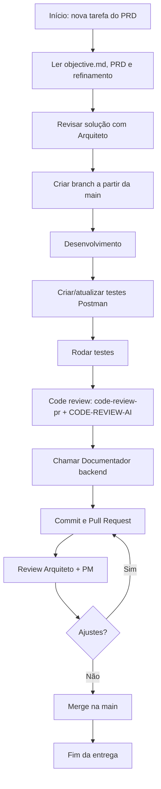

## Fluxo de Trabalho Multi‑Agentes (DBA, Backend, Frontend, Documentador)

Este documento define o **fluxo obrigatório de desenvolvimento** para os agentes **DBA**, **Backend**, **Frontend** e **Documentador do Backend** neste projeto.

- **Escopo**: vale para qualquer entrega relacionada aos épicos descritos em `PRD/*.md` e seus refinamentos técnicos.
- **Tamanho máximo de entrega**: cada Pull Request deve conter **no máximo ~500 linhas modificadas** (soma de adições + remoções) para manter code review eficiente.
- **Documentação do backend**: a pasta `docs/backend/` é mantida pelo **Agente Documentador** (`agents/documentador-backend.md`). Toda alteração no backend deve acionar o Documentador antes do commit/PR (ver passo 7 abaixo).

---

## Fluxo em sequência (visão geral)

A ordem abaixo é **obrigatória** para que a entrega esteja alinhada ao Arquiteto, ao PRD e ao refinamento:

| # | Passo | Referência |
|---|--------|------------|
| 1 | **Abrir nova branch a partir da main** | Atualizar `main`, criar branch de feature (ex.: `feature/plan-weekly`). |
| 2 | **Revisar a solução com o Arquiteto** | Seguir `refinamentos técnicos/refinamento-tecnico-001-auth-onboarding-metas.md` e validar pelo `PRD/prd-001-auth-onboarding-metas.md`; alinhar com `agents/arquiteto-software.md`. |
| 3 | **Desenvolvimento** | Implementar somente o escopo planejado (controllers, services, DTOs, schema se aplicável). |
| 4 | **Criar/atualizar os testes da API** | Usar `docs/postman/Fitness-Coach-API-Epico1.postman_collection.json`: incluir ou ajustar requests para os novos endpoints e cenários (ex.: 422). |
| 5 | **Rodar os testes** | Executar a collection no Postman (ou Runner); garantir que todos os requests passem (status e, se houver, scripts de teste). |
| 6 | **Solicitar revisão de código** | Usar `.cursor/rules/code-review-pr.mdc` e `docs/CODE-REVIEW-AI.md`: checklist de contratos, arquitetura, segurança, build + start e dependências (ex.: Prisma 7). |
| 7 | **Chamar o Documentador do Backend** | Acionar `agents/documentador-backend.md` com resumo do que foi feito; atualizar `docs/backend/` e `docs/backend/contratos-frontend.md` (request/response). |
| 8 | **Commit e Pull Request** | Fazer commit(s) incluindo código e documentação; abrir PR para `main` com descrição (PRD, refinamento, REQ-*/SCN-*). |

Após abertura do PR: **Code Review** pelo Arquiteto e pelo Product Manager; ajustes se necessário; merge somente após aprovação.

---

## Passos obrigatórios por entrega (detalhado)

### 1. Alinhamento de contexto e revisão da solução com o Arquiteto

- Ler:
  - `objective.md`;
  - o **PRD** relevante (ex.: `PRD/prd-001-auth-onboarding-metas.md`) — validar requisitos REQ-* e cenários SCN-*;
  - o **refinamento técnico** correspondente (ex.: `refinamentos técnicos/refinamento-tecnico-001-auth-onboarding-metas.md`) — seguir instruções do Backend/DBA/Frontend;
  - o arquivo do **Agente Arquiteto** (`agents/arquiteto-software.md`) para governança, contratos e manifesto de diretórios;
  - o arquivo do seu agente: `agents/backend.md`, `agents/dba.md` ou `agents/frontend.md` (quando existir).
- **Revisar a solução** (design/abordagem) com o Arquiteto: garantir que a implementação planejada está alinhada ao refinamento e ao PRD antes de codar.

### 2. Planejamento da pequena entrega

- Quebrar o trabalho em **pequenos incrementos** que gerem um PR de até ~500 linhas.
- Garantir que o incremento tenha escopo claro e critérios de aceite rastreáveis a REQ-* e SCN-* do PRD.

### 3. Criação da branch

- A partir da branch **main** (ou `master`, conforme definido):
  - atualizar a branch local: `git checkout main && git pull origin main`;
  - criar branch de feature: `git checkout -b feature/nome-descritivo` (ex.: `feature/plan-weekly`, `feature/onboarding-profile`).

### 4. Implementação e testes locais

- Desenvolver **somente** o escopo planejado para este PR.
- Garantir que não haja lints/erros básicos e que **build e subida** funcionem (`npm run build`, `npm run start:dev` no backend).

### 5. Testes da API (Postman)

- **Criar ou atualizar** a collection em `docs/postman/Fitness-Coach-API-Epico1.postman_collection.json`: adicionar requests para novos endpoints e cenários (ex.: sucesso e erro 422).
- **Rodar os testes**: executar a collection no Postman (ordem: Signup → Login → demais rotas; incluir cenário que espera 422 quando aplicável). Garantir que todos os requests retornem o status esperado e que os scripts de teste (Tests) passem.

### 6. Code Review (antes ou após abertura do PR)

- Solicitar revisão seguindo:
  - **Regra:** `.cursor/rules/code-review-pr.mdc` (checklist de contratos, arquitetura, multi-tenancy, segurança, produto, tamanho, **verificação em tempo de execução e dependências**).
  - **Guia e prompt:** `docs/CODE-REVIEW-AI.md` (como rodar o review e o que colar no prompt).
- O revisor (ou a IA) deve preencher o checklist e indicar se a aplicação foi rodada (build + start) e se há conformidade com a versão do ORM/DB (ex.: Prisma 7).

### 7. Chamar o Documentador do Backend

- **Sempre que** houver alteração em `backend/` ou `backend/prisma/`: acionar o **Agente Documentador** (`agents/documentador-backend.md`) com:
  ```
  Documentador: atualize a documentação do backend.
  **O que foi feito:** [resumo do commit ou da alteração]
  **Arquivos/módulos alterados:** [ex.: backend/src/modules/auth/, backend/prisma/schema.prisma]
  **Requisitos/cenários (opcional):** [ex.: REQ-AUTH-001]
  ```
- O Documentador atualiza `docs/backend/` (README, arquitetura, api-endpoints, modelo-dados, ambiente-e-contratos, **contratos-frontend.md**) e o `CHANGELOG.md`.
- Incluir as alterações de documentação no **mesmo commit** (ou commit seguinte na mesma branch) antes do PR.

### 8. Commit e Pull Request

- **Acionar o Agente Git** (`agents/git.md`) para commit, push e abertura do PR. O Agente Git garante que **credenciais** (`user.name`, `user.email`) estejam configuradas antes de qualquer commit e segue Conventional Commits.
- Fazer commit(s) com mensagem clara; abrir **Pull Request** da branch de feature para **main**.
- Na descrição do PR: qual PRD e refinamento, quais REQ-* e SCN-* são cobertos, tamanho aproximado em linhas (~500 máx.).

### 9. Revisão pelo Arquiteto e pelo Product Manager

- O PR deve solicitar revisão do **Agente Arquiteto** (`agents/arquiteto-software.md`) e do **Agente Product Manager** (`agents/product-manager.md`).
- Aplicar ajustes solicitados; garantir que os testes (Postman e demais) continuem passando.

### 10. Merge controlado

- Somente após aprovação do Arquiteto e aceite/opinião positiva do PM, o PR pode ser mesclado na **main**.

---

## Fluxograma em Mermaid



---

## Fluxo do Documentador do Backend

- **Responsável:** Agente Documentador (`agents/documentador-backend.md`).
- **Documentação:** `docs/backend/` (README, arquitetura, api-endpoints, modelo-dados, ambiente-e-contratos, contratos-frontend, CHANGELOG).
- **Quando é acionado:** Sempre que houver commit ou alteração em `backend/` (código ou Prisma). O Backend (ou o desenvolvedor) deve chamar o Documentador com o resumo do que foi feito (passo 7 do fluxo).
- **O que o Documentador faz:** (1) Lê o estado atual do backend; (2) Atualiza os arquivos em `docs/backend/` para refletir a realidade do código, incluindo request/response em `contratos-frontend.md`; (3) Adiciona entrada em `CHANGELOG.md`.
- **Objetivo:** Frontend, DBA e Arquiteto conseguirem trabalhar **sem contexto prévio**, usando apenas `docs/backend/` e os artefatos referenciados (PRD, schema, ADRs).

---

## Fluxo do Agente Git

- **Responsável:** Agente Git (`agents/git.md`).
- **Quando é acionado:** No passo 8 (Commit e Pull Request) ou quando o usuário pedir commit, push ou abertura de PR.
- **O que o Agente Git faz:** (1) Verifica se `user.name` e `user.email` estão configurados; se não, informa o usuário e não commita até a configuração. (2) Garante que não há arquivos sensíveis no stage. (3) Faz commit(s) com Conventional Commits, push da branch e indica o link para abrir o PR.
- **Objetivo:** Não esquecer credenciais e manter commits/PRs consistentes com o fluxo do projeto.

---

## Regras adicionais

- **Nenhum agente** (DBA, Backend, Frontend) deve:
  - introduzir mudanças grandes que não caibam em PRs de até ~500 linhas;
  - mesclar código diretamente na branch principal sem PR e sem review.
- Em caso de necessidade de alteração de contratos globais (OpenAPI, Prisma, ADRs, `AGENTS.md`):
  - abrir uma tarefa específica para o **Agente Arquiteto**,
  - aguardar novos artefatos de arquitetura antes de implementar.
